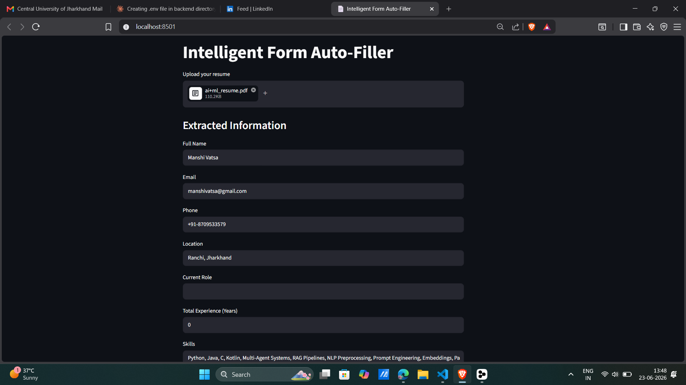

# Intelligent Form Auto-Filler

AI-powered form auto-filler that extracts information from uploaded resumes (PDF/DOCX/Image) and automatically populates a job application form.

## Tech Stack

- FastAPI
- Streamlit
- Groq API (LLaMA 3.1)
- pdfplumber
- python-docx
- Pillow

## Features

- Supports PDF, DOCX, JPG/PNG upload
- LLM-based field extraction
- Editable fields before submission
- Clean REST API backend

## How to Run Locally

1. Start the backend:
   ```bash
   uvicorn backend.main:app --reload
   ```

2. Start the frontend:
   ```bash
   streamlit run frontend/app.py
   ```

## Environment Variables

- `GROQ_API_KEY` - Your Groq API key for LLaMA 3.1 access

## Approach

Document text is extracted using pdfplumber/python-docx/Pillow, sent to Groq LLaMA model with a structured prompt, response parsed as JSON and mapped to form fields.
## Screenshots
